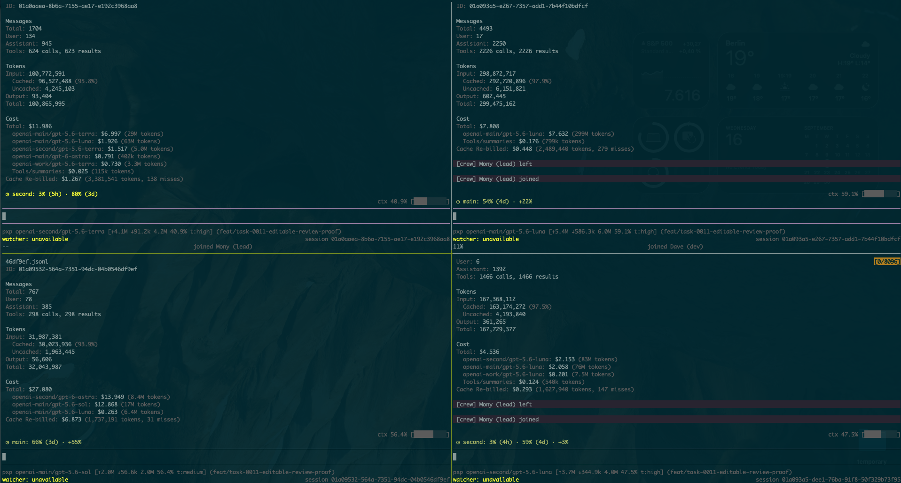

# Pi Bebop


<div>
Make independent Pi instances part of a dysfunctional but effective crew.
</div>

</br>
</br>
</br>
</br>
</br>

## What is Pi Bebop

Pi Bebop lets independent Pi sessions work as a crew.
Each member has a name, a role, and its own conversation, context, and tools.
Members can join from different worktrees or paths and talk to each other without sharing a conversation.

The thing is, communication is not the same as orchestration.
Bebop moves messages and tracks who has joined. It doesn't assign tasks, pick workers, or decide when work is done.
Your crew decides how to work.

## Why Bebop

- **Keep each member independent.** Each role can keep working in its own Pi session, with its own context, plans, and tools.
- **Keep context around.** An ongoing session lets repeated calls reuse input cached by the model provider. The example below shows 97.9% cached input for dev and 97.5% for QA.
- **Keep crew identity in the project.** Names, roles, sockets, and instructions live in a trusted `.pi/bebop/crew.json`, not a global registry.
- **Say what kind of message you mean.** Send information, ask for a response, leave something in an inbox, or interrupt stuck work. Each operation has a different promise.

### Cache reuse in practice



These are results from one Crew on September 16, 2026, not guaranteed rates or a benchmark against subagents.
Subagents can reuse cached input too. Results depend on the provider, model, and workload (Bebop doesn't implement a model cache).

The percentages count cached input tokens, not requests that hit a cache.
Repeated calls can reuse earlier input, so these totals are cumulative. They aren't the size of each session's context.

## Install

### Pi extension

```bash
pi install npm:@carbon-ni/pi-bebop
```

Or install from GitHub:

```bash
pi install git:github.com/carbon-ni/pi-bebop
```

### CLI

```bash
npm install -g @carbon-ni/pi-bebop
bebop --help
```

Without a global install:

```bash
npx @carbon-ni/pi-bebop --help
```

For command help, use `bebop <command> --help`.
Use `--help` or the standard `-h` flag for subcommands; both show Commander-generated help.

CLI results are concise plain text by default. Use `--format toon` for structured agent output or large bounded results, and `--format json` for interoperability; format selection never changes automatically by result size.

## Start a Crew

```bash
bebop crew init
bebop crew roles
```

`crew init` creates `.pi/bebop/crew.json`, shared and role instructions, and a `sockets/` directory.
It doesn't prompt or overwrite existing files. An exact rerun changes nothing; partial or conflicting layouts return an error.
Review the names, Intake contact, and instructions before joining.

`crew roles` lists the exact roles configured in that manifest. It doesn't start a server or join a member.
Start each member in a separate terminal, using its configured role:

```bash
pi --crew-role lead
pi --crew-role developer
```

Then use `/crew members` inside Pi to see who's `current`, `online`, or `offline`.
Bebop's agent tools are available only while the member is joined.

When a joined Pi session has no display name, Bebop names it with the exact trusted
manifest Member name. Existing names from `--name`, `/name`, RPC, or another
extension are preserved. Renaming the session manually immediately takes ownership;
Bebop will not overwrite or clear that name on later joins, switches, leaves, or shutdown.
See [Crew setup](docs/CREW-INIT.md) for the manifest and instruction details.

## Resume a session by role

To pick an earlier session for a role in the current Crew:

```bash
bebop session resume --role developer
```

Choose a result and Bebop opens that exact Pi session in its original working directory.
It doesn't copy the conversation, start a new session, or resume the whole Crew.
Cancel the picker, or find no matching sessions, and nothing launches.

The picker only includes sessions with recorded membership matching the current Crew, role, and manifest fingerprint.
Older sessions without that record, or sessions whose record no longer matches, won't appear.
Plain `pi -r` stays unchanged. See [role session resume](docs/ROLE-SESSION-RESUME.md) for the matching and safety rules.

## Bookmark Member sessions together

A **Crew Session** is a named bookmark stored on your machine.
It links a Crew to the exact Pi Session of each Member captured while online.
It isn't a shared conversation or a way to launch everyone at once.

Capture before closing the sessions you want to keep:

```bash
bebop session capture "auth regression"
bebop session list
bebop session show <crew-session-id>
bebop session resolve <crew-session-id> <member>
```

Capture records missing Members with a reason instead of guessing their latest session.
Use `session add <id> <member>` to fill a missing link without replacing an existing one.

Unlike the role picker, `session resolve` doesn't launch Pi.
It validates the saved session and returns the command and working directory separately.
Review them, then run the returned `pi --session <absolute-file>` command yourself.
It doesn't add role, socket, model, or prompt flags.

An open endpoint returns `already-open`. An unreachable endpoint is not proof that the session is closed, and resolution doesn't lock it.
See [Crew Sessions](docs/CREW-SESSION.md) for identity checks, storage, privacy, and stale sessions.

## Choose how to communicate

| Tool                  | Use it when                                            | What it promises                                                                                                                                                                                                                                                      |
| --------------------- | ------------------------------------------------------ | --------------------------------------------------------------------------------------------------------------------------------------------------------------------------------------------------------------------------------------------------------------------- |
| `send_member_request` | You need an answer, report, or verdict                 | Requests one response tied to your request. Use `wait_for_request_outcome` with the returned `request_id`; after `pending-after-idle`, wait again with the same ID.                                                                                                   |
| `send_follow_up`      | You're sharing information                             | Accepted delivery, with no response expected.                                                                                                                                                                                                                         |
| `redirect_member`     | You need to change what a member does next             | Delivers guidance before the next model step, without aborting the turn.                                                                                                                                                                                              |
| `send_to_inbox`       | The member may be offline                              | Persists the message for later delivery as one ordinary Follow-up. Online recipients are offered it on the next FIFO continuation; offline delivery waits for join/restore/turn-end. Items 48 hours or older are labeled stale and must be revalidated before acting. |
| `interrupt_member`    | Work is stuck, harmful, or based on a wrong assumption | Tries to abort and deliver recovery guidance. It can't undo work already done.                                                                                                                                                                                        |
| `broadcast_to_crew`   | Everyone else needs the same information               | Attempts delivery to each other member and reports each outcome. It doesn't save messages to an inbox.                                                                                                                                                                |

Accepted delivery doesn't mean the member read the message or finished the work.
A response doesn't prove the result is correct either.

From the CLI, use `bebop member request send` followed by `bebop member request wait`, or `bebop ask <crew[/member]>`, when you need a response tied to a request.
Member delivery commands (`member follow-up`, `member redirect`, `member inbox send`, `crew broadcast`) confirm accepted or persisted delivery — never completion.

### Waiting isn't proof of progress

`wait_for_member_idle` waits for the member to become idle, go offline, or reach the timeout.
An incoming Bebop message can also release the wait. That doesn't mean the member became idle or finished anything.
Call this wait on its own, not in a parallel tool batch, so an incoming message can be consumed immediately.

`wait_for_request_outcome` requires the exact `request_id` returned by `send_member_request`. It waits for that Request's response, offline result, one nonterminal `pending-after-idle` notice, or terminal max-wait. If an accepted message wakes the wait, process it and call the tool again with the same ID; do not send a replacement solely because the wait ended.
An incoming Bebop message can release this wait too, so it can be handled before waiting again.
That doesn't settle the request or guarantee a response.
See [Member requests](docs/MEMBER-REQUEST-WORKFLOW.md) for the full flow.

## What Bebop doesn't decide

- Roles describe responsibility, not permissions. When more than one member has a role, use an exact member name.
- Online and idle describe observed runtime state, not availability or progress.
- Accepting a message, saving it, or returning a response doesn't mean a task is complete.
- Bebop doesn't own tasks, Git, reviews, or CI. It doesn't pick workers, classify message content, or guarantee exactly-once execution.

## What's new in 0.2.0

- **Sessions:** bookmark Member sessions and use a separate picker to resume a session by role.
- **Commander-native CLI:** running `bebop` (or `--help`) prints the root command tree; each group and leaf has its own generated help. Syntax errors go to stderr with exit 2 and local usage, operational failures to stderr with exit 1, and successful results keep `--format text|toon|json`.
- **Session CLI:** `session` replaces the former `crew session` command family.
- **Guests:** admit and revoke trusted guests, send direct messages, and broadcast in a defined order.
- **Waits and requests:** tie responses to requests, wake waits for incoming messages, and report timeouts and failures explicitly.

## Development

```bash
npm install
npm run build
npm test
```

To use the CLI from this checkout:

```bash
npm link
bebop --help
```

Or install a packed release into a project:

```bash
npm install ./carbon-ni-pi-bebop-0.2.0.tgz
npx bebop --help
```

`make all` runs the pre-push gate: format, package, lint, build, test, and security checks.
Release verification is separate because it installs pinned consumer dependencies and may need network access:

```bash
make package-verify
```
